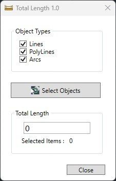
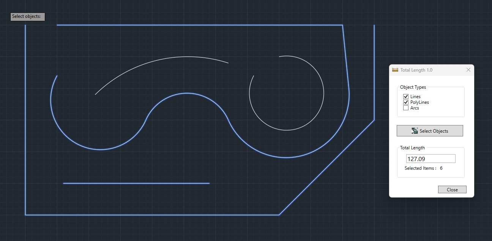

# CodeHaks **TotalLength** for AutoCAD


[](https://github.com/codehaks/acad-TotalLength/actions/workflows/ci.yml)
[](docs/build-and-load.md)
[](docs/build-and-load.md#autocad-version-matrix)
[](docs/architecture.md#target-frameworks)
[](#requirements)
[](LICENSE)
[](docs/contributing.md)

**CodeHaks TotalLength** is an AutoCAD .NET add-on that reports the total length of selected `LINE`, `LWPOLYLINE`, and `ARC` entities in the active drawing. The add-on registers an in-AutoCAD command (`ZLen`) and a ribbon entry on the **Codehaks** tab; users pick the object types they care about, run a selection, and see total length plus a count.

The codebase is built around a single shared-source project that is compiled into three per-AutoCAD-version assemblies — one for AutoCAD 2024 (.NET Framework 4.8) and one each for AutoCAD 2025 / 2026 (.NET 8 on Windows).

---

## Highlights

- **Selection-aware length reporting** — filters by entity type (`LINE`, `LWPOLYLINE`, `ARC`) and sums curve length using the AutoCAD `Curve` API.
- **MVVM WPF UI** — modal dialog parented to the AutoCAD main window, bound to a `MainViewModel` with `INotifyPropertyChanged` and `RelayCommand<T>`.
- **Ribbon integration** — adds a *Codehaks* tab with a *Total Length* button that fires the `ZLen` command via `SendStringToExecute`.
- **Multi-version build** — one shared project (`src/Shared/`), three thin per-version csprojs that differ only in target framework and AutoCAD reference paths.
- **Single one-shot builder** — [`build.bat`](build.bat) compiles all targets and collects DLLs into `dist/AutoCAD <year>/`.

---

## Requirements

| | |
| :--- | :--- |
| **OS** | Windows 10 / 11, x64 |
| **AutoCAD** | 2024, 2025, or 2026 (installed at `C:\Program Files\Autodesk\AutoCAD <year>\`) |
| **.NET (build-time)** | .NET Framework 4.8 SDK *and* .NET 8 SDK |
| **Build tools** | MSBuild 17+ / Visual Studio 2022 17.8+ |

See [docs/build-and-load.md](docs/build-and-load.md) for the full version matrix.

---

## Quick start

### Build everything

```bat
build.bat              :: Release into dist\AutoCAD 2024|2025|2026\
build.bat Debug        :: Debug build
```

Or build a single target:

```bat
msbuild "src\TotalLength 2026\TotalLength 2026.csproj" /p:Configuration=Release
```

### Load into AutoCAD

1. Launch AutoCAD 2024, 2025, or 2026.
2. Run the `NETLOAD` command.
3. Pick `dist\AutoCAD <year>\codehaks.TotalLength.dll`.
4. Either run the `ZLen` command, or click **Codehaks ▸ Total Length** on the ribbon.

Full walkthrough: [docs/build-and-load.md](docs/build-and-load.md).

---

## In-AutoCAD commands

| Command | Description |
| :--- | :--- |
| `ZLen` | Opens the **Total Length** WPF dialog (modal to AutoCAD). |
| `DrawCircle` | *(Debug builds only)* — draws a fixed-radius circle; used as a smoke-test command during development. |

---

## Documentation

| Document | What's inside |
| :--- | :--- |
| [docs/architecture.md](docs/architecture.md) | High-level design, layering, namespaces, AutoCAD interop notes. |
| [docs/build-and-load.md](docs/build-and-load.md) | Build pipeline, version matrix, `NETLOAD` instructions. |
| [docs/developer-guide.md](docs/developer-guide.md) | Day-to-day development workflow, code map, debugging in AutoCAD. |
| [docs/testing.md](docs/testing.md) | How to add unit tests and integration tests against AutoCAD APIs. |
| [docs/roadmap.md](docs/roadmap.md) | Future ideas, suggested improvements, technical-debt items. |
| [docs/contributing.md](docs/contributing.md) | Branching, commit conventions, review checklist. |

---

## Screenshots

### Main Window


### AutoCAD Workflow Example


---

## Support

Open an issue on the GitHub repo, or email **[support@codehaks.com](mailto:support@codehaks.com)**.

---

## License

Released under the [MIT License](LICENSE).

---

**CodeHaks TotalLength** — Simplify your AutoCAD measurements.
